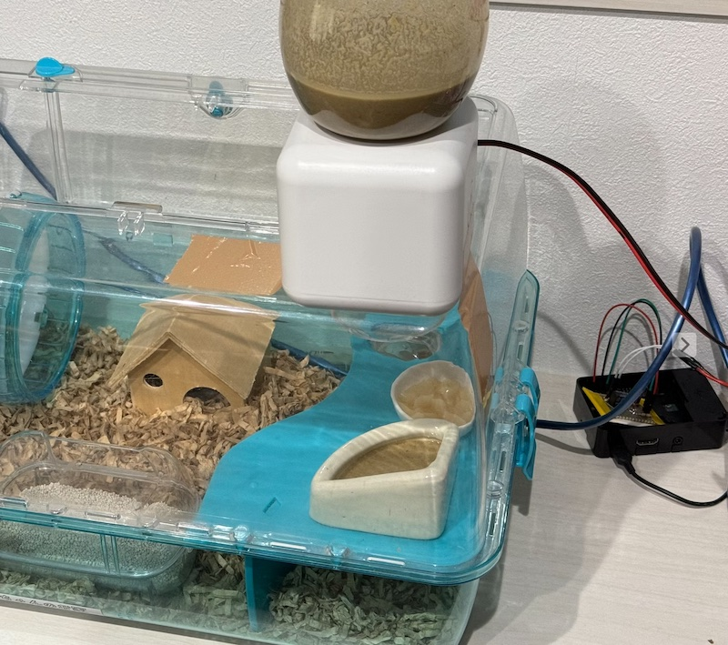

# ハムスターの遠隔餌やり機（液体限定）

年老いた硬いカリカリを食べられないハムスター向けの液体餌やり機です。
スマホを使って遠隔で餌をあげられます。

より詳しい詳細は[Qiita記事](https://qiita.com/komasayuki/items/592141602d78920b2d8f)をご覧ください。

システム構成


処理の流れ


## Server side

`% cd ./server` 

### Docker Build

```shell
% docker build -t feed-server .
```

### Execute
```shell
% docker run -d -p 8080:8080 feed-server

# or exec without containerizing
% npm start
```


### Test

```shell
# Websocketで接続、次のcurl POSTコマンドを実行した後に、feedと表示されたらOK
% wscat -c "ws://12.34.56.78?secret=YOUR-SECRET-TOKEN"
Connected (press CTRL+C to quit)
< feed
```

別ターミナルで
```shell
# スマホ側でPOSTする操作と同じことをcurlで実行する
% curl -X POST -d 'feed' "http://12.34.56.78?secret=YOUR-SECRET-TOKEN"
# wscat側でfeedと表示されることを確認
```


### Deploy
ご利用のサーバーにコンテナをデプロイしてください。
その際、環境変数`SECRET`の指定が必須です。


## Raspberry Pi

`% cd ./rpi` 

### Setup

```shell
% npm install
```

### Execute
```shell
% FEEDER_SERVER_URL="ws://localhost:8080/?secret=hamster" npm start
```

ローカル開発時は`secret`は`hamster`になっています。これは`./server/config/development.env`で変更できます。

### Test

```shell
% curl -X POST -d 'feed' "ws://localhost:8080?secret=hamster"
```

またはスマホアプリ[API Tester](https://apps.apple.com/jp/app/api-tester-scripts-terminal/id1575521212)などでPOSTを送る。

URLは実際にデプロイしたサーバーのアドレスに合わせること。